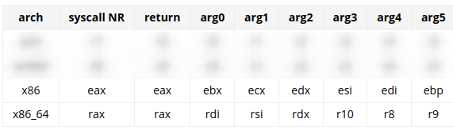

# x86 

## Hello World 

```assembly 
section .text 
    global _start 
_start : 
        mov rax, 1 
        mov rdi, 1 
        mov rsi, _str 
        mov rdx, 14 
        syscall 

        mov rax, 60 
        mov rdi, 0
        syscall
section .data
    _str db "Hello, world",0xa
```

to run : 

```sh
$ nasm -f elf64 hello.asm -o hello.o 
$ ld hello.o -o hello 
$ ./hello 
hello
```
**Principal of everything we are doing is same as ARM ASM**

## Calling conventions 




- `.text` section 
    - We are using syscall code for write (1) to print on screen. So we set rax to 1 to set syscall code 
    - set arg0 i.e fd using **rdi register** - 1 (stdout)
    - set arg1 i.e buf (what to write) using **rsi register**- `_str`
    - set arg2 i.e `size_t count` (count of characters) - 14 using **rdx register** 
    - then syscall using **syscall**

    thats it for `write()` but what about exit 

    - set `rax` register to 60 (syscall code for exit) 
    - set `rdi` register to 0 (return value)  
    - syscall 
- '.data' section 
    - we use `_str` is the label name  `db` which stands for **define bytes**, 0xa is for a newline char 

## `mov_add` 

```assembly 
section .text 

global _start 
_start : 
    mov rax, 60 
    mov rbx, 5
    mov rdi, 10
    add rdi, rbx 
    syscall  ; this should output 15
```

output : 
```sh
$ ./bin/mov_add 
$ echo $?
15
```

- syscall mode - exit (syscall code = 60)
- we can use any register because we are not using anything like write() where reg. matters 
- rbx = 5 
- rdi (return code) = 10
- rdi = rdi + rbx = 10 + 5 = 15 
- syscall 
